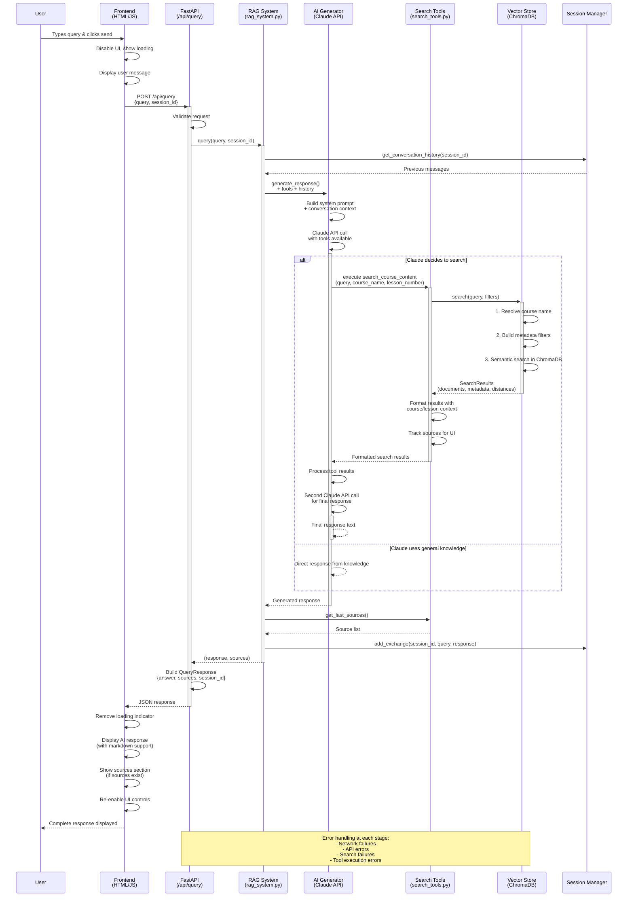
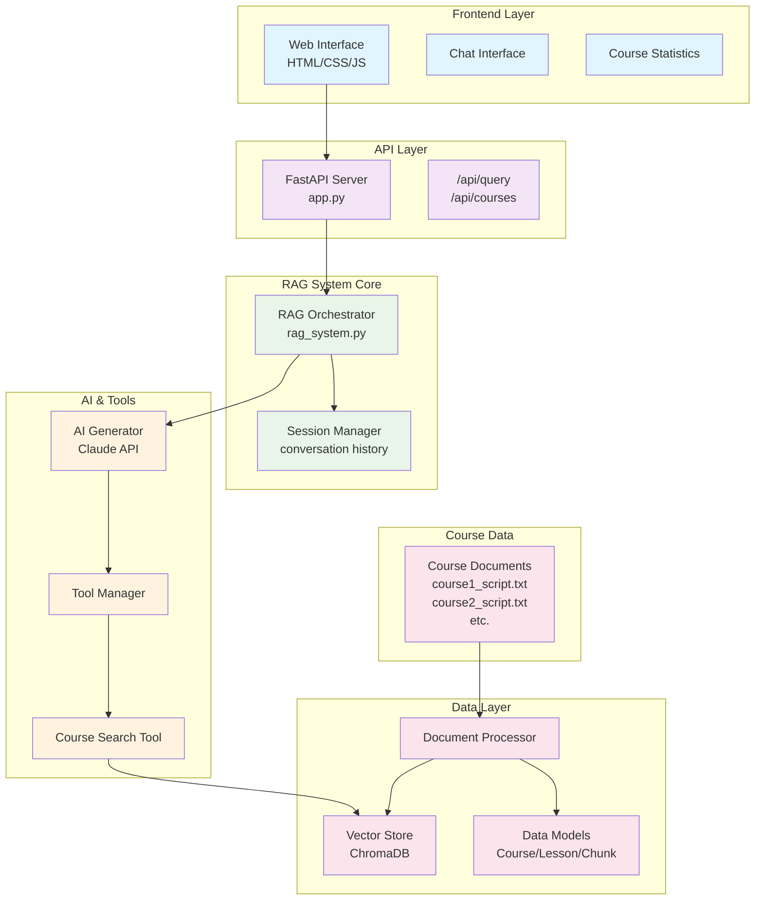

# RAG System Query Flow Diagram

## Architecture Overview

## Data Flow Summary

1. **User Query** → Frontend captures and sends to API
2. **API Routing** → FastAPI validates and routes to RAG system  
3. **RAG Orchestration** → Manages session context and coordinates components
4. **AI Processing** → Claude analyzes query and decides on tool usage
5. **Tool Execution** → Searches course content using vector similarity
6. **Vector Search** → ChromaDB finds relevant course chunks with metadata
7. **Response Generation** → AI synthesizes search results into answer
8. **Session Update** → Conversation history maintained for context
9. **API Response** → Structured response with answer, sources, session ID
10. **Frontend Display** → Renders response with markdown and source citations

## Key Features

- **Semantic Search**: Uses sentence transformers for meaningful content matching
- **Course Resolution**: Handles partial course name matches  
- **Session Continuity**: Maintains conversation context across queries
- **Tool Intelligence**: AI decides when to search vs. use general knowledge
- **Source Attribution**: Tracks and displays specific course/lesson sources
- **Error Resilience**: Graceful handling of failures at each layer